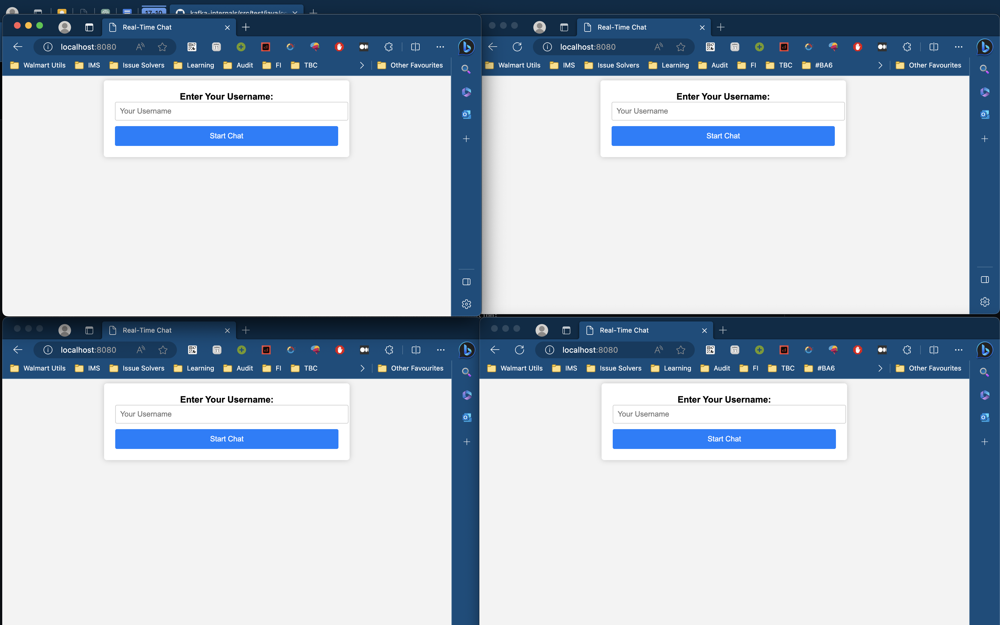
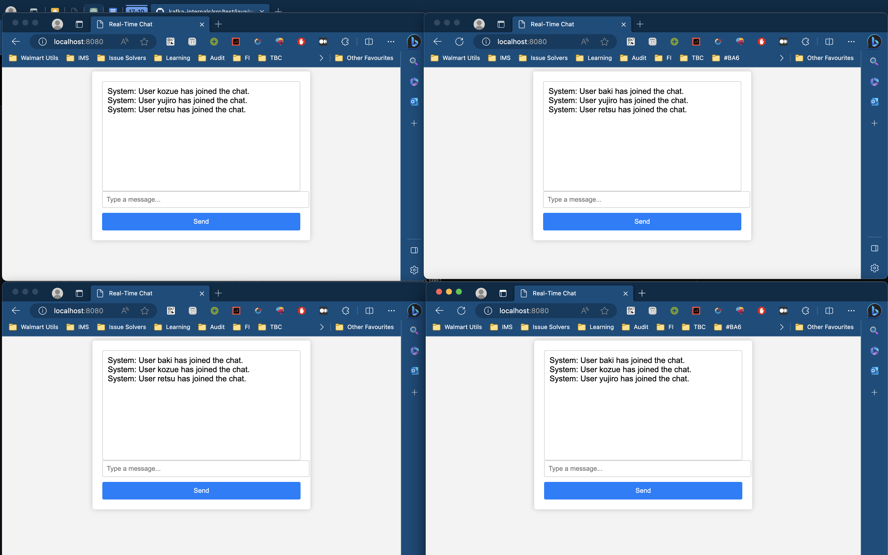
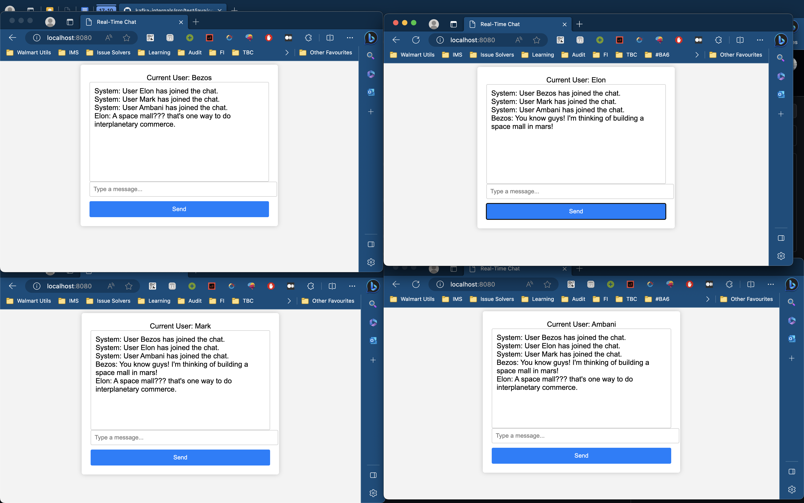
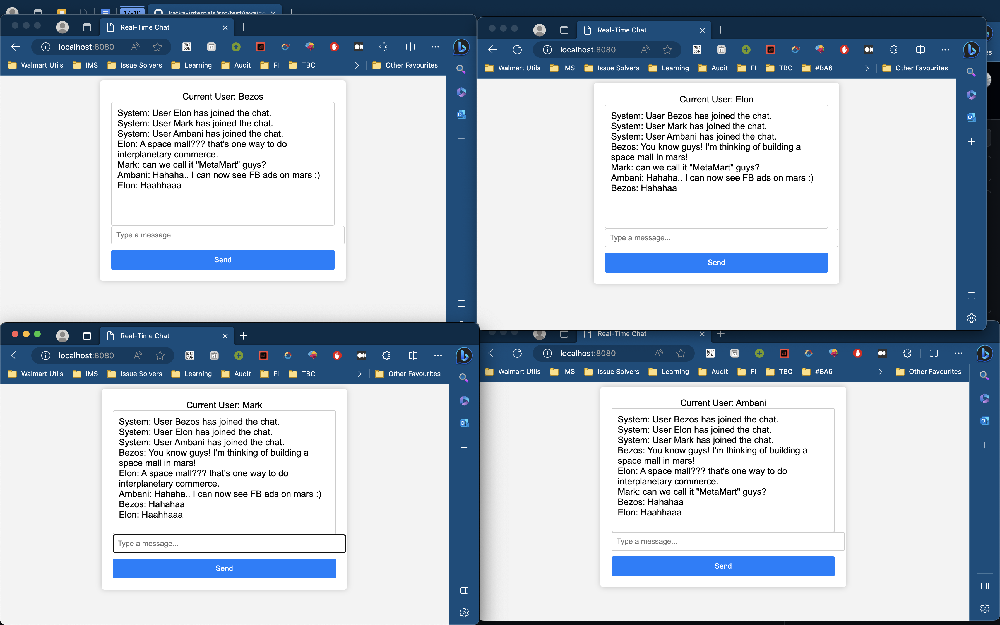

# Real-Time Chat Application

A simple real-time chat application built using HTML, JavaScript, and a Go-based WebSocket server.

## Table of Contents

- [Overview](#overview)
- [Features](#features)
- [Demo](#demo)

## Overview

This project is a basic real-time chat application that allows users to join a chat room, send messages, and see messages from other participants. The chat application is built using HTML, JavaScript for the client-side, and a Go-based WebSocket server for real-time communication.

## Features

- User-friendly interface for entering a username and starting the chat.
- Real-time messaging with WebSocket communication.
- Messages include the user's name.
- Clean and simple design.

## Demo

